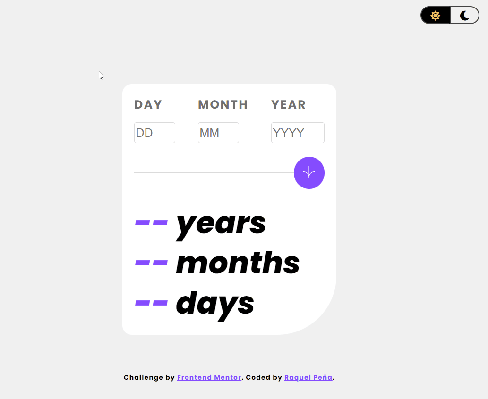
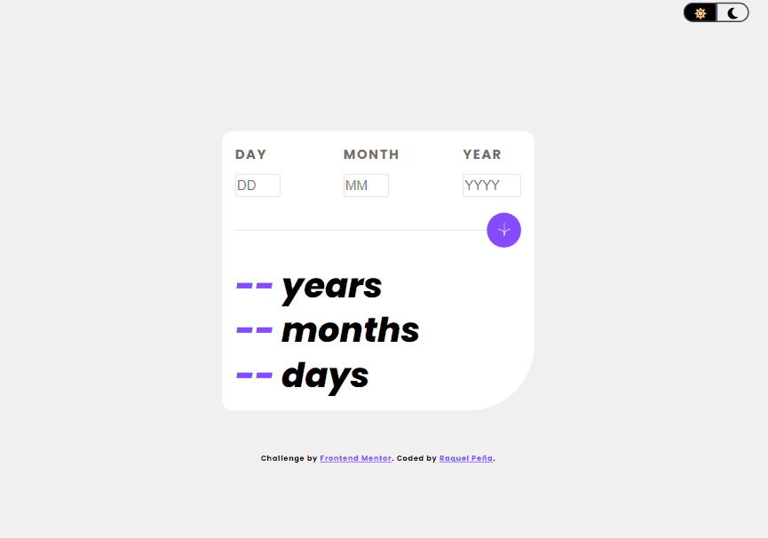
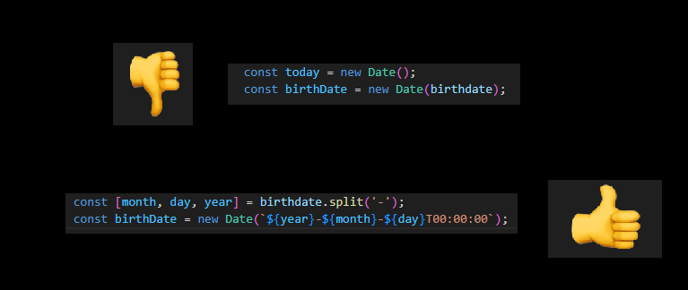

# Age-calculator-app by [Raquel Peña](https://www.linkedin.com/in/raquel-pe-go/)

This a solution of the [Age Calculator App on Frontend Mentor](https://www.frontendmentor.io/challenges/age-calculator-app-dF9DFFpj-Q).
Frontend Mentor challenges help you to improve your coding skills by creating realistic projects, if you don't know the website I recommend you to access as they have many free and leveled proposals.

<h2 id="table-of-contents"> __φ(。。)  Table of Contents</h2>

- [Overview](#overview)
  - [The challenge](#challenge)
  - [Demo](#demo)
  - [Link](#link)
- [My process](#process)
  - [Built with](#built)
  - [What I learned and reviewed](#learned)
  - [Continued development](#continued)
  - [Useful resources](#useful)
- [Extras](#extras)
  - [Dark Mode](#dark)
  - [The hardest part](#hardest)
  - [What you need to make it yours](#make-it-yours)
- [Who is Raquel](#who)

---

<h2 id="Overview">Overview 💻</h2>
 
<h2 id="challenge"> (ﾉ´ヮ`)ﾉ*: ･ﾟ The challenge</h2>

Users should be able to:

- View an age in years, months, and days after submitting a valid date through the form
- Receive validation errors if:
  - Any field is empty when the form is submitted
  - The day number is not between 1-31
  - The month number is not between 1-12
  - The year is in the future
  - The date is invalid e.g. 31/04/1991 (there are 30 days in April)
- View the optimal layout for the interface depending on their device's screen size
- See hover and focus states for all interactive elements on the page

---

<h2 id="demo">
w(°ｏ°)w Demo 	</h2>

 </img>

---

<h2 id="extras"> Extras ❕❕	</h2>
 

<h2 id="dark"> (⌐■_■) Dark Mode </h2>
 

 </img>

---

<h2 id="hardest">(╬ Ò﹏Ó) The hardest part </h2>

I was about to give up, it worked from a computer, from an android phone too, but when I tried it from an Iphone, it didn't work. 
After researching, sleepless nights and being left without friends for monothematic, I understood that not all devices have the same date format. 
And that's how the division came into my life.

 </img>

---

<h2 id="make-it-yours"> (๑˘︶˘๑)  What you need to make it yours</h2>

It is made with HTML, Css and Javascript so you don't need anything special. You can access directly by clicking on the [link](https://rpg87.github.io/Age-calculator-app/), you can fork the project or you can download the entire game. It is up to you.

---

<h2 id="who"> (≧▽≦)/    Who is Raquel</h2>

 I am <strong> Raquel</strong>, I consider myself a person with a great sense of humor, always eager to learn, a lover of challenges and this combination is what led me to study web development.

If you want to know more about me or if you have a fun project and you need help we could work together, you can find me [here](https://www.linkedin.com/in/raquel-pe-go/)

---

<h2 align= "center">If you have made it this far, I thank you and wish you a <strong> happy day</strong>. 	</h2>
<h2 align= "center">(⊃｡•́‿•̀｡)⊃
</h2>

---

### [Back to the top](#table-of-contents) ⥉
